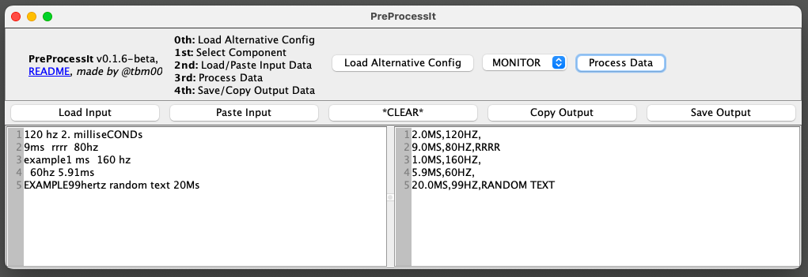

# PreProcessIt
A highly configurable, rule‑based text processor that parses and normalizes messy input data into structured output.
 
Using a user-defined algorithm, PreProcessIt transforms unstructured input (from CSVs, TXTs, and more) into well-formatted, standardized output. PreProcessIt leverages a configurable processing pipeline to handle complex tokenization and data transformation requirements, making it an effective tool for a range of data processing tasks.

Created by tbm00.

## Overview
PreProcessIt follows the Model-View-Controller (MVC) design pattern, ensuring clean separation of concerns and maintainability. The program processes input data line-by-line and token-by-token, dynamically matching tokens against a set of attributes defined in customizable component configurations. Depending on whether tokens satisfy specific conditions, the system applies a series of configurable actions to standardize the data.



## Key Features
  - **Configurable Parsing Engine:** Define custom parsing algorithms and attribute‑matching rules via YAML, then locate and standardize those attributes in your input data using the qualifiers you've specified.
  - **Advanced Token Handling:** After tokenizing the input line, PreProcessIt parses tokens using configurable rules that consider neighboring tokens, enabling complex pattern matching and data transformation.
  - **Robust Error Handling & Logging:** Detailed logging and error management provide transparency during data processing, enabling quick troubleshooting and config creation.
  - **User-friendly GUI & CLI:** Use the GUI to import, process, and export data, or use the CLI for headless processing!

## Dependencies
  - **Java 8+**: REQUIRED

## Usage
  - #### GUI Mode
    With Java installed, double-click the program's JAR file (or run `java -jar PreProcessIt-0.1.7-beta.jar`) to launch the GUI. Then:
    - Load your alternative config *(defaults to: `/PreProcessIt/config.yml`)*
    - Select the component configuration to use *(if you have more than one defined)*
    - Paste or import your input data from a file
    - Click "Process Data"
    - Copy or export your output data to a file

  - #### Headless Command
    With Java installed, run:
      - `java -jar PreProcessIt-0.1.7-beta.jar --config <config.yml> [--component <name>] --input <input.*> --output <output.*> [--log]`

## How It Works
PreProcessIt reads input data one line at a time and splits each line into tokens. For every attribute in your selected component's configuration, the program checks if the current working word (normally the `WORKING_TOKEN`) matches the attribute using the attribute's qualifiers. If there is a match, the qualified actions will run; otherwise, the unqualified actions will run. 

Correctly implemented qualifiers contain:
  - **Word Source:** Which String value to evaluate; e.g., the current working token, a copy of the initial token, or tokens from neighboring positions
  - **Condition:** The criteria a token must meet; e.g., containing a specific string, matching a specific data type, etc.
  - **Value:** The expected literal or range for validation
  - **Actions:** Procedures to execute when a token is deemed qualified or unqualified. These actions may modify the token, skip iterations, try neighboring tokens, and "ship" the token to the attribute's final output.

You may also use qualifiers on the entire input or output line by using LineRules!

### Line Processing Algorithm
  - **1st:** Prior to beginning the attribute processing for the current input line, the line will be transformed by the InputLineRules, if any are defined.
  - **2nd:** After the InputLineRules rules finish processing, the attributes' qualifiers will get processed in order as defined, on each token. Once a value has been "shipped" for a particular attribute, the program will continue to search the line's unprocessed tokens for the next attribute, until all attributes have run their checks. * 
  <ul> <ul>
  * <em>After shipping an attribute with a <code>SHIP</code> action, call the <code>DECLARE_TOKEN_PROCESSED</code> action to mark the token as processed so it isn't processed by later attributes, then call the <code>EXIT_TO_NEXT_ATTRIBUTE_ITERATION</code> exit action to exit the current attribute's iteration. In some rare cases, you may not want to call them, so to support that behaviour these actions are not automatically called when shipping.</em>
</ul> </ul>  

  - **3rd:** After all attributes have run their qualifiers' checks, the output line will be built from the shipped attributes, and then transformed by all defined OutputLineRules (this is where you can append the leftovers and/or original line).
  - **4th:** After the OutputLineRules rules finish processing, the newly transformed output line is finalized.

### Example
Using the [basic default config](#default-config), PreProcessIt transforms messy input:
```
120 hz 2. milliseCONDs
9ms  rrrr  80hz
example1 ms  160 hz
  60hz 5.91ms
EXAMPLE99hertz random text 20Ms
```
into a standardized, CSV-like output:
```
original_input,response_time,refresh_rate,leftovers
120 hz 2. milliseCONDs,2.0MS,120HZ,
9ms  rrrr  80hz,9.0MS,80HZ,RRRR
example1 ms  160 hz,1.0MS,160HZ,
  60hz 5.91ms,5.9MS,60HZ,
EXAMPLE99hertz random text 20Ms,20.0MS,99HZ,RANDOM TEXT
```
which still looks a bit messy, but that's only because there is an OutputLineRule to prepend the original input line to the output line, and the leftovers are appended.

## Configuration

### Default Config
Use the [PreProcessIt Default Config](src/main/resources/config.yml) to assist in creating your own algorithms.

### Available Words
| Word | Description |
|------|-------------|
| `WORKING_TOKEN` | Current working token that may be modified by prior qualifiers |
| `INITIAL_TOKEN_COPY` | Static copy of the initial working token (therefore, unmodified by prior qualifiers) |
| `LEFT_NEIGHBOR` | The token preceding the current token in the input line |
| `RIGHT_NEIGHBOR` | The token following the current token in the input line |
| `WORKING_LINE` | Current working line that may be modified by prior qualifiers; **Only used by LineRules** |
| `INITIAL_LINE_COPY` | Static copy of the initial input line (therefore, unmodified by prior qualifiers) |

### Available Conditions
| Condition | Clarification |
|-----------|---------------|
| `GREATER_THAN` | Numerical values only |
| `GREATER_THAN_EQUAL_TO` | Numerical values only |
| `LESS_THAN` | Numerical values only |
| `LESS_THAN_EQUAL_TO` | Numerical values only |
| `IN_BETWEEN_INCLUSIVE` | Numerical values only; Format: `<min>,<max>` |
| `IN_BETWEEN_EXCLUSIVE` | Numerical values only; Format: `<min>,<max>` |
| `START_IN_BETWEEN_INCLUSIVE` | Numerical values only; Format: `<min>,<max>` |
| `START_IN_BETWEEN_EXCLUSIVE` | Numerical values only; Format: `<min>,<max>` |
| `END_IN_BETWEEN_INCLUSIVE` | Numerical values only; Format: `<min>,<max>` |
| `END_IN_BETWEEN_EXCLUSIVE` | Numerical values only; Format: `<min>,<max>` |
| `EQUALS_VALUE` | Numerical values only |
| `EQUALS_STRING` | Case insensitive |
| `CONTAINS` | Case insensitive |
| `STARTS_WITH` | First character(s) match; Case insensitive |
| `ENDS_WITH` | Last character(s) match; Case insensitive |
| `START_IS_TYPE` | `INTEGER`, `DOUBLE`, `NUMBER`, or `STRING` |
| `END_IS_TYPE` | `INTEGER`, `DOUBLE`, `NUMBER`, or `STRING` |
| `IS_TYPE` | `INTEGER`, `DOUBLE`, `NUMBER`, or `STRING` |
| `IS_EMPTY` | Configured 'value' doesn't matter |
| `NOT_IN_BETWEEN_INCLUSIVE` | Numerical values only; Format: `<min>,<max>` |
| `NOT_IN_BETWEEN_EXCLUSIVE` | Numerical values only; Format: `<min>,<max>` |
| `NOT_EQUALS_VALUE` | Numerical values only |
| `NOT_EQUALS_STRING` | Case insensitive |
| `NOT_CONTAINS` | Case insensitive |
| `NOT_STARTS_WITH` | First character(s) match; Case insensitive |
| `NOT_ENDS_WITH` | Last character(s) match; Case insensitive |
| `NOT_IS_TYPE` | `INTEGER`, `DOUBLE`, `NUMBER`, or `STRING` |
| `NOT_IS_EMPTY` | Configured 'value' doesn't matter |

### Available Actions
  - The qualifiers get processed in order. Likewise, within each qualifier, the actions get processed in order until there are none left. If a qualifier's running action list doesn't end with an exit action, then the next qualifier will get processed once the current action list finishes running.
  - Use the `CONTINUE_TO_NEXT_QUALIFIER`, `CONTINUE_AND_SKIP_NEXT_QUALIFIER`, `EXIT_TO_NEXT_TOKEN_ITERATION`, `EXIT_TO_NEXT_ATTRIBUTE_ITERATION`, and `EXIT_TO_NEXT_LINE_ITERATION` exit actions to control the exit flow of the qualifier's action list processing.
  - Be sure to use `DECLARE_TOKEN_PROCESSED` actions before exit actions when the token no longer needs to be processed by other attributes' qualifiers.
  - Anywhere you pass a String as an action parameter (except fromString parameters), you may use `$INITIAL_LINE_COPY$` or `$INITIAL_TOKEN_COPY$` as a placeholder. Similarly, in the OutputLineRules, you may pass in `$LEFTOVERS$`.

| Action | Description |
|--------|-------------|
| `CONTINUE_TO_NEXT_QUALIFIER` | Continue to the next qualifier on current attribute iteration |
| `CONTINUE_AND_SKIP_NEXT_QUALIFIER(count)` | Skip next qualifier(s) on current attribute iteration |
| `TRY_NEIGHBORS(max_characters)` | Try appending/prepending neighbors' characters to the current working word's value to see if it might qualify with the same matcher, then continue to next actions after possibly updating the working word's value; **DOESN'T** modify the neighboring tokens in the token list |
| `NEW_TOKEN_FROM_MATCH` | Create new token with the matched value, placed after the current working token; **DOESN'T** modify the current token in the token list |
| `NEW_TOKEN_FROM_UNMATCHED` | Create new token with the unmatched value, placed after the current working token; **DOESN'T** modify the current token in the token list |
| `DECLARE_TOKEN_PROCESSED` | Mark the current token as processed, so that it doesn't get processed by other attributes' qualifiers; The main way to declare tokens as processed |
| `SHIP` | Ship current working word's value as the current attribute's final value; **DOESN'T** mark current token as processed |
| `EXIT_TO_NEXT_TOKEN_ITERATION` | Go to next token iteration on current attribute iteration |
| `EXIT_TO_NEXT_ATTRIBUTE_ITERATION` | Go to next attribute iteration on current line iteration |
| `EXIT_TO_NEXT_LINE_ITERATION` | Go to next line iteration |
| `DELETE_LINE` | Completely remove current line from getting processed and outputted, then go to next line iteration; **Only used by LineRules** |
| `TRIM_MATCH_FROM_LEFT_NEIGHBOR` | Remove matched value from the back of the prior token, if it's there; **DOES** modify the neighboring token in the token list, & afterwards, if the neighboring token is empty, it's marked as processed |
| `TRIM_MATCH_FROM_RIGHT_NEIGHBOR` | Remove matched value from the front of the next token, if it's there; **DOES** modify the neighboring token in the token list, & afterwards, if the neighboring token is empty, it's marked as processed |
| `TRIM_MATCH_FROM_TOKEN` | Remove all occurrences of the matched value from the current token; **DOES** modify the token in the token list, & afterwards, if the token is empty, it's marked as processed |
| `TRIM_UNMATCHED_FROM_TOKEN` | Remove all occurrences of the unmatched value from the current token; **DOES** modify the token in the token list, & afterwards, if the token is empty, it's marked as processed |
| `TRIM_MATCH_ALL` | Remove all occurrences of the matched value from the working word's value |
| `TRIM_MATCH_FIRST` | Remove first occurrence of the matched value from the working word's value |
| `TRIM_MATCH_START` | Remove matched value from working word's value if the token begins with the matched value |
| `TRIM_MATCH_END` | Remove matched value from working word's value if the token ends with the matched value |
| `TRIM_UNMATCHED_ALL` | Remove all occurrences of the unmatched value from the working word's value |
| `TRIM_UNMATCHED_FIRST` | Remove first occurrence of the unmatched value from the working word's value |
| `TRIM_UNMATCHED_START` | Remove the unmatched value from working word's value if it begins with the unmatched value |
| `TRIM_UNMATCHED_END` | Remove the unmatched value from working word's value if it ends with the unmatched value |
| `REPLACE_MATCH_ALL(toString)` | Replace all occurrences of the matched value in the working word's value with `toString`; Case sensitive |
| `REPLACE_MATCH_FIRST(toString)` | Replace first occurrence of the matched value in the working word's value with `toString`; Case sensitive |
| `KEEP_MATCH` | Set current working word's value to equal only the matched value |
| `ROUND(type,amount)` | Round working word's value to nearest `amount`; Applicable types: `up`, `down`, `nearest` |
| `FORMAT_NUMBER(format,commaGroups)` | Reformat working word's value; Accepts format like `#.##` or `#`; If commaGroups is `true`, then number will have commas every 3 digits like "100,000" |
| `SET_CASING(casing)` | Set casing of the working word's value; Applicable casings: `upper`, `lower` |
| `REPLACE_ALL(fromString,toString)` | Replace all occurrences of `fromString` in the working word's value with `toString`; Case sensitive |
| `REPLACE_FIRST(fromString,toString)` | Replace first occurrence of `fromString` in the working word's value with `toString`; Case sensitive |
| `INSERT_AT(index,String)` | Insert a `String` at a specific index in working word's value |
| `APPEND(String)` | Attach a `String` to the end of working word's value |
| `PREPEND(String)` | Attach a `String` to the start of working word's value |

## License
PreProcessIt is released under the [PreProcessIt Non-Commercial License](LICENSE).

This license permits non-commercial use, but any commercial use, modification, copying, or redistribution is prohibited without explicit permission.
